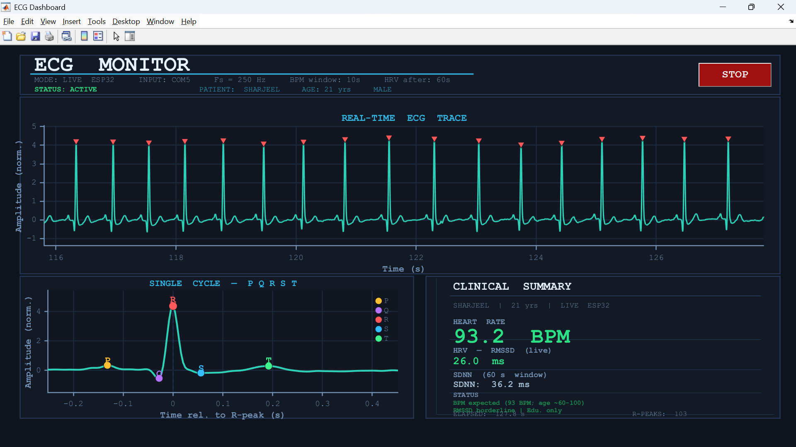
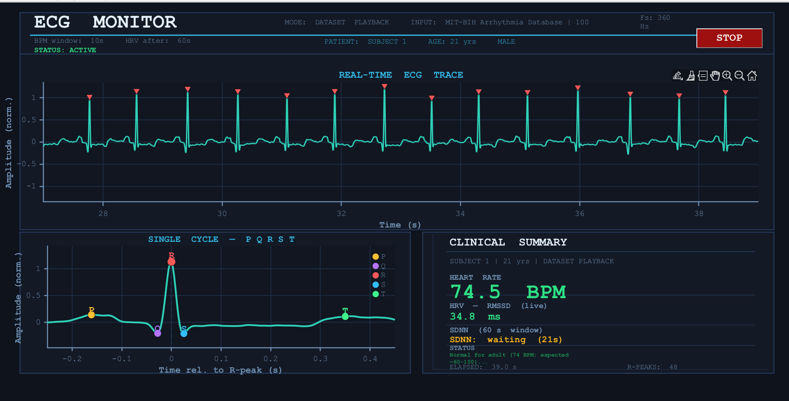
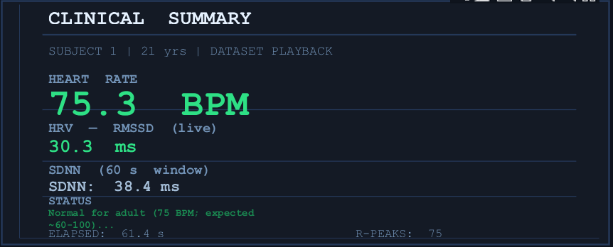
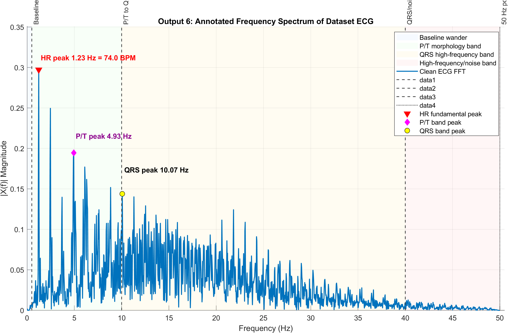
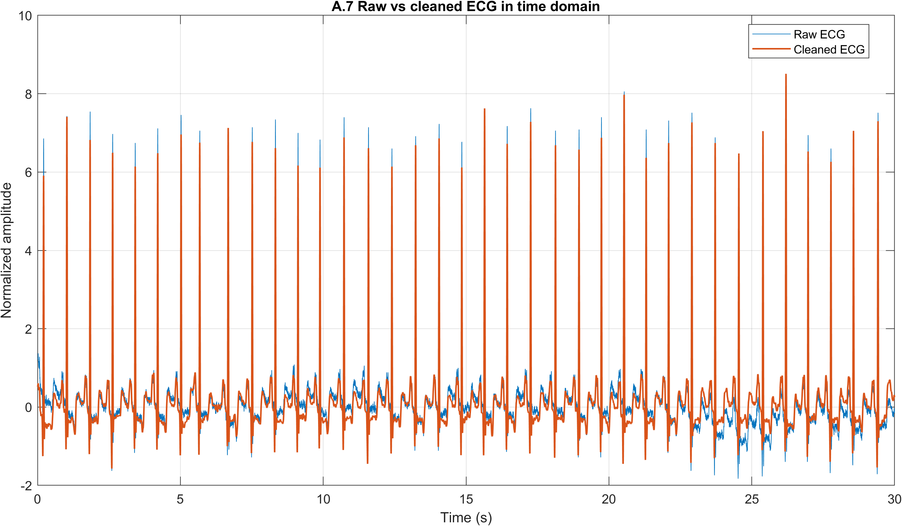
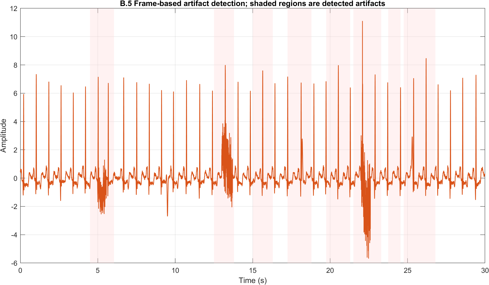
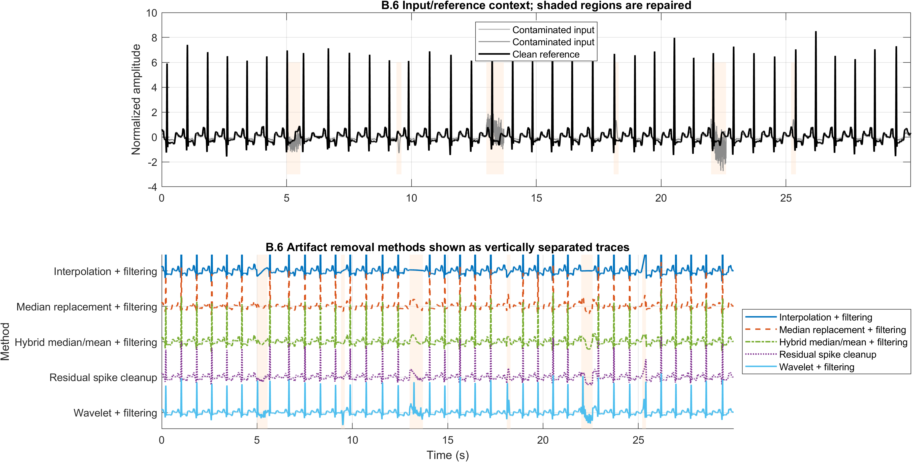
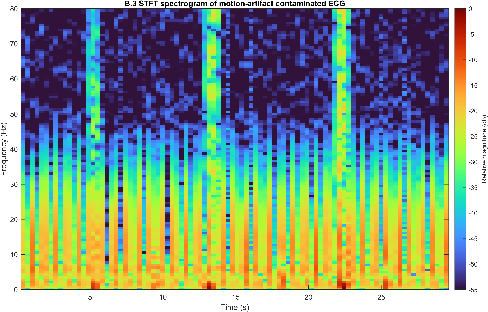
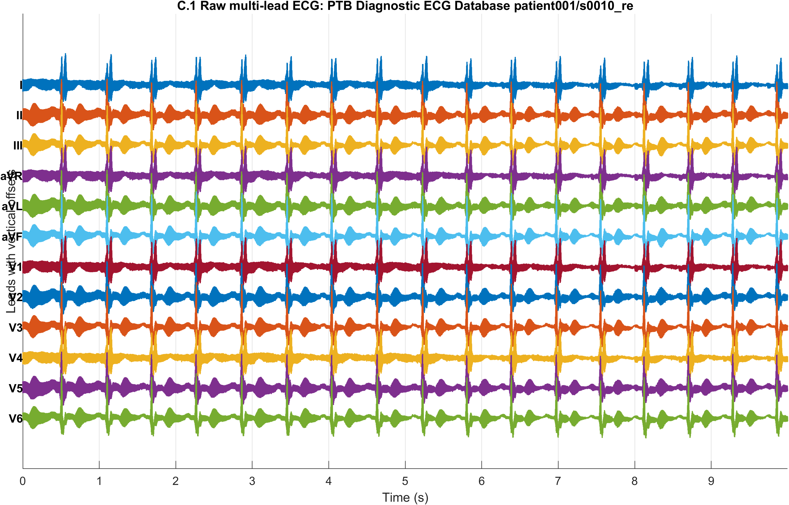
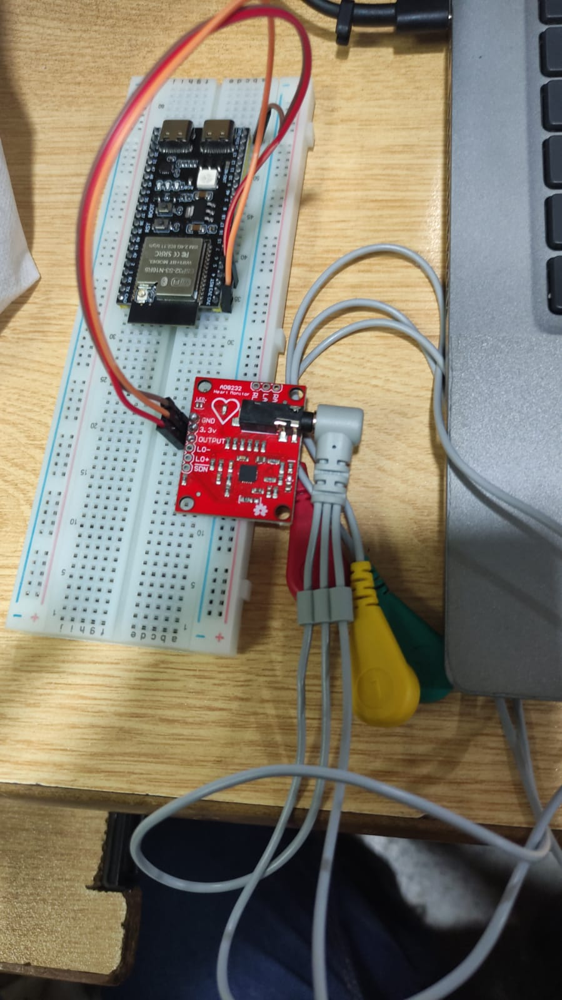

# ECG Signal Processing and Real-Time Monitoring

MATLAB project for ECG acquisition, visualization, frequency-domain analysis, denoising, motion-artifact removal, and multi-lead phase analysis. The project supports both offline ECG datasets and real-time ECG acquisition using an ESP32 with an AD8232 front-end module.

This repository was developed for a DSP course project by Group 5.

## Highlights

- Real-time ECG dashboard for ESP32/AD8232 hardware and dataset playback.
- R-peak detection, BPM estimation, HRV metrics, and P-Q-R-S-T cycle visualization.
- FFT-based ECG frequency analysis with annotated physiological and noise bands.
- Classical ECG denoising with high-pass, notch, and low-pass filters.
- IIR/FIR filter response, phase, and group-delay comparison.
- Non-stationary motion-artifact detection using STFT and frame features.
- Artifact repair using interpolation, median replacement, hybrid smoothing, residual spike cleanup, and optional wavelet denoising.
- Optional 12-lead phase-consistency analysis using PTB multi-lead ECG data.

## Dashboard Preview

These dashboard screenshots were taken from the project report.

| Live ESP32/AD8232 mode |
|---|
|  |

| Dataset playback mode | Clinical summary panel |
|---|---|
|  |  |

## Signal Processing Outputs

| Dataset FFT analysis | Stream A denoising |
|---|---|
|  |  |

| Stream B motion artifact detection | Stream B artifact removal |
|---|---|
|  |  |

| Stream B STFT spectrogram | Stream C 12-lead ECG |
|---|---|
|  |  |

## Hardware Setup

The live acquisition path uses an ESP32 and AD8232 ECG module. The ESP32 sketch streams one ADC sample per line over serial to MATLAB.



Default hardware settings:

| Setting | Value |
|---|---|
| ECG ADC pin | GPIO 4 |
| Serial baud rate | 115200 |
| Sampling rate | 250 Hz |
| MATLAB default port | COM4 |
| Power-line frequency | 50 Hz |

Upload [`ESP32_AD8232_ECG_Serial.ino`](ESP32_AD8232_ECG_Serial.ino) to the ESP32 before running the live dashboard. If AD8232 lead-off pins are wired, enable `USE_LEADS_OFF` in the sketch.

## Requirements

- MATLAB.
- Signal Processing Toolbox.
- Optional WFDB Toolbox for MATLAB for direct PhysioNet loading through `rdsamp`.
- Arduino IDE or PlatformIO for ESP32 firmware upload.
- ESP32 board and AD8232 ECG module for live ECG acquisition.

If WFDB is unavailable, the MATLAB scripts can fall back to manual `.csv` or `.mat` ECG file selection.

## Quick Start

1. Open MATLAB in the repository root.
2. Run the dashboard:

```matlab
ECG_Task1_Dashboard_Enhanced
```

3. Choose **Live ESP32 / AD8232** or **Dataset / saved ECG file**.
4. Save an FFT window from the dashboard if hardware frequency analysis is needed.
5. Run the task scripts below to regenerate figures, tables, and written outputs.

## Main Scripts

| Script | Purpose |
|---|---|
| [`ECG_Task1_Dashboard_Enhanced.m`](ECG_Task1_Dashboard_Enhanced.m) | Real-time/dataset ECG dashboard with BPM, HRV, R-peaks, FFT export, and cycle view. |
| [`Task1B_Dataset_Frequency_Analysis.m`](Task1B_Dataset_Frequency_Analysis.m) | Dataset ECG FFT analysis, R-peak HR comparison, annotated frequency plots, and report tables. |
| [`Task1B_Hardware_Frequency_Analysis.m`](Task1B_Hardware_Frequency_Analysis.m) | Same frequency-analysis workflow for ECG windows saved from hardware acquisition. |
| [`Task2_StreamA_Denoising.m`](Task2_StreamA_Denoising.m) | Classical filtering, SNR improvement, filter response, phase response, and group-delay analysis. |
| [`Task2_StreamB_MotionArtifact.m`](Task2_StreamB_MotionArtifact.m) | Motion-artifact simulation/detection, STFT analysis, artifact repair, and quantitative method comparison. |
| [`Task2_StreamC_MultiLead_Optional.m`](Task2_StreamC_MultiLead_Optional.m) | Optional 12-lead phase-consistency analysis using causal and zero-phase filtering. |
| [`ESP32_AD8232_ECG_Serial.ino`](ESP32_AD8232_ECG_Serial.ino) | ESP32 firmware for serial ECG streaming from AD8232. |

## How To Run Each Part

### 1. Dashboard

```matlab
ECG_Task1_Dashboard_Enhanced
```

Use this for live monitoring or dataset playback. The dashboard shows:

- Real-time ECG trace.
- Detected R-peaks.
- BPM and HRV values.
- Single-cycle P-Q-R-S-T morphology.
- Clinical status text based on age and heart-rate range.
- FFT window export to `ECG_FFT_Window_*.csv` and `ECG_FFT_Window_*.mat`.

### 2. Task 1B: Dataset Frequency Analysis

```matlab
Task1B_Dataset_Frequency_Analysis
```

Outputs are saved in [`Task1B_outputs/`](Task1B_outputs/). This script generates R-peak plots, full FFT plots, 0-50 Hz zoomed spectra, annotated frequency-band figures, BPM comparison tables, dataset information tables, and written commentary.

### 3. Task 1B: Hardware Frequency Analysis

```matlab
Task1B_Hardware_Frequency_Analysis
```

Use this after saving a dashboard ECG window. Select an `ECG_FFT_Window_*.csv` or `.mat` file when prompted. Outputs are saved in [`Task1B_hardware_outputs/`](Task1B_hardware_outputs/).

### 4. Task 2 Stream A: Classical Denoising

```matlab
Task2_StreamA_Denoising
```

Stream A applies and evaluates:

- 0.5 Hz high-pass filtering for baseline wander.
- 50 Hz notch filtering for mains interference.
- 40 Hz low-pass filtering for high-frequency noise.
- FIR alternatives for phase and group-delay comparison.
- SNR before/after filtering.

Outputs are saved in [`Task2_StreamA_outputs/`](Task2_StreamA_outputs/).

### 5. Task 2 Stream B: Motion Artifact Processing

```matlab
Task2_StreamB_MotionArtifact
```

Stream B demonstrates why fixed filters alone are weak against transient motion artifacts. It uses STFT and frame-level features to detect artifact regions, then compares several repair methods.

Outputs are saved in [`Task2_StreamB_outputs/`](Task2_StreamB_outputs/).

### 6. Task 2 Stream C: Multi-Lead Phase Analysis

```matlab
Task2_StreamC_MultiLead_Optional
```

Stream C uses a PTB multi-lead ECG record to compare causal IIR filtering with zero-phase filtering. It measures timing changes using cross-correlation lag and summarizes clinical impact.

Outputs are saved in [`Task2_StreamC_outputs/`](Task2_StreamC_outputs/).

## Core Methods

| Area | Methods |
|---|---|
| ECG acquisition | ESP32 serial streaming, dataset playback, saved CSV/MAT windows |
| Preprocessing | Median removal, normalization, polarity handling |
| Denoising | Butterworth high-pass, Butterworth low-pass, 50 Hz notch |
| FIR comparison | Hamming-window FIR high-pass and low-pass filters |
| R-peak detection | Adaptive thresholding, peak distance, and peak prominence |
| HR and HRV | RR BPM, RMSSD, SDNN |
| Frequency analysis | Single-sided FFT, ECG band annotation, HR fundamental estimate |
| Motion artifact | STFT, window-size comparison, frame energy and variance features |
| Artifact repair | Interpolation, median replacement, hybrid smoothing, spike cleanup, optional wavelet denoising |
| Multi-lead timing | Phase/group delay, causal vs zero-phase filtering, cross-correlation lag |

## Repository Structure

```text
.
|-- ECG_Task1_Dashboard_Enhanced.m
|-- ESP32_AD8232_ECG_Serial.ino
|-- Task1B_Dataset_Frequency_Analysis.m
|-- Task1B_Hardware_Frequency_Analysis.m
|-- Task2_StreamA_Denoising.m
|-- Task2_StreamB_MotionArtifact.m
|-- Task2_StreamC_MultiLead_Optional.m
|-- ecg_*.m
|-- mitdb/
|-- ptbdb_patient001/
|-- readme_assets/
|-- Task1B_outputs/
|-- Task1B_hardware_outputs/
|-- Task2_StreamA_outputs/
|-- Task2_StreamB_outputs/
`-- Task2_StreamC_outputs/
```

## Representative Generated Files

- [`Task1B_outputs/Output6_dataset_annotated_fft.png`](Task1B_outputs/Output6_dataset_annotated_fft.png)
- [`Task1B_hardware_outputs/Output6a_hardware_annotated_fft.png`](Task1B_hardware_outputs/Output6a_hardware_annotated_fft.png)
- [`Task2_StreamA_outputs/dataset_mitdb/A7_SNR_table.png`](Task2_StreamA_outputs/dataset_mitdb/A7_SNR_table.png)
- [`Task2_StreamB_outputs/dataset_mitdb/B7_method_comparison_table.png`](Task2_StreamB_outputs/dataset_mitdb/B7_method_comparison_table.png)
- [`Task2_StreamC_outputs/C4_corrected_12lead_zero_phase.png`](Task2_StreamC_outputs/C4_corrected_12lead_zero_phase.png)
- [`Task2_StreamC_outputs/C6_max_timing_error_table.png`](Task2_StreamC_outputs/C6_max_timing_error_table.png)

## Notes

- The default mains frequency is `50 Hz`, matching Pakistan's power-line frequency.
- Dataset scripts use MIT-BIH Arrhythmia Database record `100` where available.
- Stream C uses PTB Diagnostic ECG Database record `patient001/s0010_re` where available.
- Hardware ECG quality depends on electrode placement, grounding, cable motion, and subject stillness.
- This project is for DSP learning and experimentation. It is not a medical diagnostic device.

